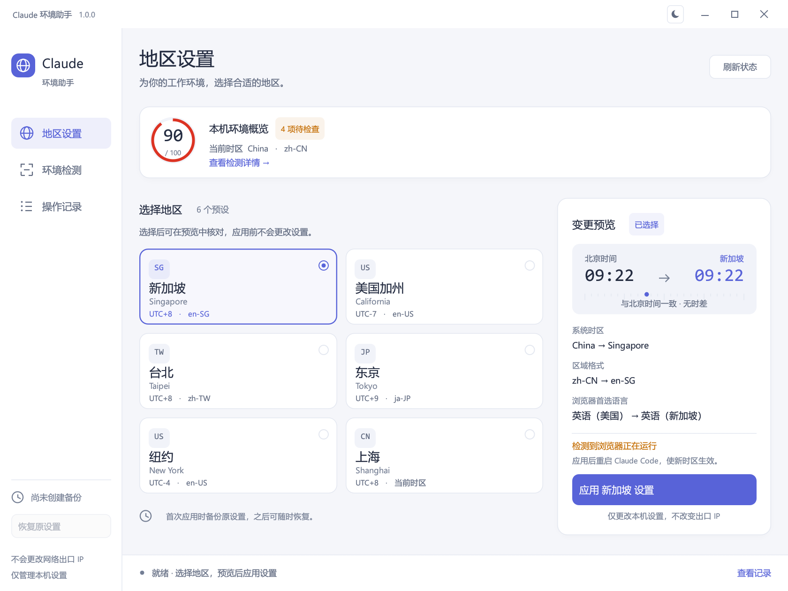

<p align="center">
  
</p>

<h1 align="center">Claude Environment Helper</h1>

<p align="center">
  <strong>Claude 环境助手</strong><br />
  地区设置、环境检测与备份恢复，一处管理。
</p>

<p align="center">
  <a href="https://github.com/Tsuki-hash/claude-env-helper/releases/latest"></a>
  
  
  <a href="LICENSE"></a>
</p>

<p align="center">
  <a href="https://github.com/Tsuki-hash/claude-env-helper/releases/latest/download/claude-fingerprint.exe"><strong>下载 Windows 版</strong></a>
  &nbsp; · &nbsp;
  <a href="rust/README.md">使用手册</a>
  &nbsp; · &nbsp;
  <a href="https://github.com/Tsuki-hash/claude-env-helper/releases">更新记录</a>
  &nbsp; · &nbsp;
  <a href="https://github.com/Tsuki-hash/claude-env-helper/issues">反馈问题</a>
</p>

<br />

<p align="center">
  <picture>
    <source media="(prefers-color-scheme: dark)" srcset=".github/assets/workspace-dark.png" />
    <source media="(prefers-color-scheme: light)" srcset=".github/assets/workspace-light.png" />
    
  </picture>
</p>

<p align="center"><sub>先选择地区，核对变更，再应用设置。支持浅色与深色主题。</sub></p>

## 为本机环境提供清晰的控制

面向使用 Claude Code 的 Windows 用户，集中管理系统时区、区域格式和 Chromium 系浏览器语言。修改前查看预览，修改后保留恢复原设置的入口。

| 地区设置 | 环境检测 | 备份恢复 |
| :--- | :--- | :--- |
| 六个地区预设，切换前展示时间对照和设置变更。 | 六项本机信号读数，区分可调整设置与需自行处理的事项。 | 原设置加密备份，按浏览器配置分别记录和还原。 |

| 独立的网络视角 | 清晰的操作记录 | 图形界面与命令行 |
| :--- | :--- | :--- |
| 按需查询第三方出口 IP 估算，提供加载与重试反馈。 | 查看每一步结果，筛选提示和失败项，复制完整记录。 | 日常操作使用桌面界面；脚本可调用同一个程序。 |

## 开始使用

1. [下载 `claude-fingerprint.exe`](https://github.com/Tsuki-hash/claude-env-helper/releases/latest/download/claude-fingerprint.exe)，双击打开。
2. 选择地区并核对变更预览。新加坡与台北均为 UTC+8，与北京时间无时差。
3. 完全退出浏览器后点击 **应用设置**，然后重启 Claude Code。需要回退时使用 **恢复原设置**。

Windows 的自动时区设置可能覆盖手动修改；如果设置被改回，请检查「设置 → 时间和语言 → 日期和时间」。详细说明见 [使用手册](rust/README.md)。

<details>
<summary><strong>命令行用法</strong></summary>

```powershell
# 读取本机状态
.\claude-fingerprint.exe status

# 追加第三方出口 IP 估算
.\claude-fingerprint.exe status --remote

# 应用新加坡设置
.\claude-fingerprint.exe apply singapore

# 恢复备份中的原设置
.\claude-fingerprint.exe restore
```

支持 `singapore`、`california`、`taipei`、`tokyo`、`newyork` 和 `shanghai`。不带参数运行打开图形界面。

</details>

<details>
<summary><strong>名称与已有版本兼容</strong></summary>

项目现名为 **Claude 环境助手 / Claude Environment Helper**。程序文件和命令保留 `claude-fingerprint.exe`，已有脚本可继续使用。

备份和主题偏好仍位于 `%LOCALAPPDATA%\ClaudeFingerprint\`。截图展示更名后的界面，当前 v1.0.0 发行程序仍保留原显示名称。

</details>

## 了解作用范围

| 本工具可调整 | 仅检测，需自行处理 | 不提供 |
| :--- | :--- | :--- |
| 系统时区、区域格式、Chromium 浏览器语言 | 中转地址、NTP 校时配置、字体环境、国产浏览器安装情况 | 代理服务、隐藏 IP、DNS 或 WebRTC 泄露检测 |

> [!IMPORTANT]
> 修改时区会影响机器上的所有程序。本机评分是规则估算，不代表账号安全或服务可用性；修改本机设置不会改变网络出口。出口 IP 查询会向第三方服务暴露你的出口 IP。

<details>
<summary><strong>项目背景与参考资料</strong></summary>

项目起源于社区对 Claude Code 地区特征检测的分析。相关时区识别机制尚未经 Anthropic 官方证实，工具也不承诺绕过地区限制。使用时请遵守相关服务条款与所在地法律。

- [时区与中转地址检测分析](https://ip.net.coffee/claude/timezone.html)
- [检测信号参考：LinXiaoTao/FuckClaude](https://github.com/LinXiaoTao/FuckClaude)（MIT）
- [完整功能说明、评分权重与手动还原方法](rust/README.md)

</details>

## 从源码构建

需要 Windows x64 与 Rust MSVC 工具链。

```powershell
cd rust
cargo build --release --locked
```

程序生成于 `rust/target/release/claude-fingerprint.exe`。[构建与打包说明](rust/README.md#-从源码构建)包含测试、打包及签名流程。

## 反馈与贡献

欢迎通过 [Issues](https://github.com/Tsuki-hash/claude-env-helper/issues) 提交问题或功能建议。报告问题时请附上 Windows 版本、程序版本和复现步骤，并隐藏截图或日志中的密钥与个人信息。

代码变更请使用英文 [Conventional Commits](https://www.conventionalcommits.org/en/v1.0.0/) 信息，例如 `feat: add region preset` 或 `fix: handle missing browser profiles`。

## 许可证

[MIT](LICENSE) © 2026 [Tsuki-hash](https://github.com/Tsuki-hash)。第三方组件的许可证与声明见 [THIRD-PARTY-LICENSES.md](THIRD-PARTY-LICENSES.md)。
